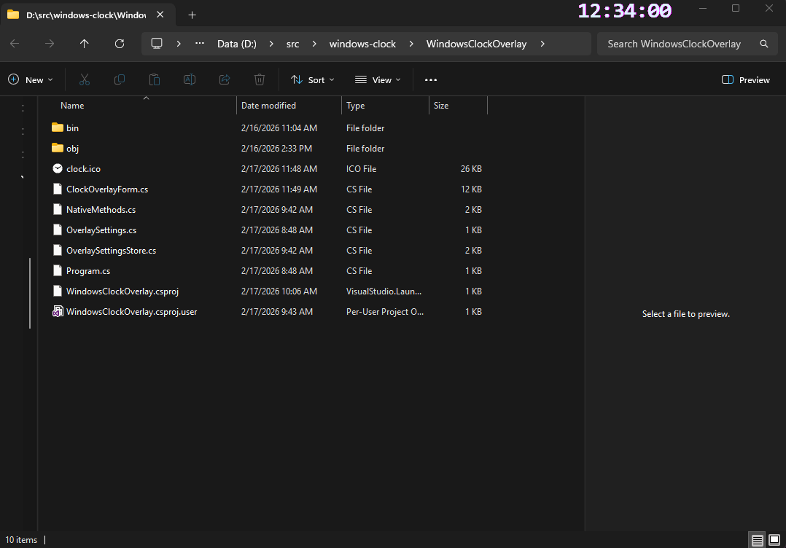

# Windows Clock Overlay

A tiny FRAPS-style clock overlay for Windows.
Always on top. Draggable. Minimal.

## Why this exists
When gaming, streaming, or watching videos in fullscreen, it is annoying to tab out just to check the time.
This app keeps a compact digital clock visible in a screen corner.

## Features
- Always-on-top digital clock (`HH:mm:ss`)
- Transparent background
- Drag-and-drop positioning
- Position and color persistence between launches
- 12 built-in color presets in tray menu
- Lightweight WinForms app, no heavy dependencies

## Download
Use prebuilt binaries from the GitHub Releases page:
- https://github.com/jrvelloso/windows-clock-overlay/releases/latest

If no release is available yet, build from source.

Direct download:
- https://github.com/jrvelloso/windows-clock-overlay/releases/latest/download/WindowsClockOverlay-win-x64.zip

## Run from source
```powershell
cd .\WindowsClockOverlay
dotnet run
```

## Build release binary
```powershell
cd .\WindowsClockOverlay
dotnet publish -c Release -r win-x64 --self-contained false
```

Output:
`WindowsClockOverlay\bin\Release\net8.0-windows\win-x64\publish\WindowsClockOverlay.exe`

## Usage
- Drag the clock with left-click + hold to reposition.
- Right-click the tray icon to change color, reset position, or exit.

## Screenshots
Clock visible in Windows Explorer:



Clock highlighted for visibility:


## Fullscreen behavior
Works over normal windows and borderless fullscreen windows.
Some exclusive fullscreen rendering modes can still draw above overlays.

## Contributing
Issues and PRs are welcome. See:
- `CONTRIBUTING.md`
- `.github/ISSUE_TEMPLATE/bug_report.yml`
- `.github/ISSUE_TEMPLATE/feature_request.yml`

## Support
If this project helps you, you can support development on Ko-fi:
- [ko-fi.com/jrvelloso](https://ko-fi.com/jrvelloso)

## Roadmap
- Optional 12h format
- Optional custom fonts
- Optional startup with Windows
- winget package

## License
MIT. See `LICENSE`.
